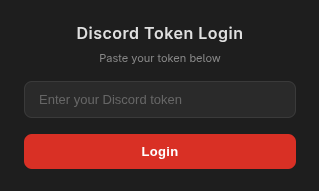

# Discord Token Login Extension

A Chrome extension that allows you to log in to Discord using a token. Built with TypeScript and Manifest V3.

> **⚠️ Educational purposes only.** Do not use this for any malicious activities.



## Features

- Log in to Discord with a token
- Automatically clears Discord cookies before login
- Dark modern UI with a minimal popup

## Installation

### From source

1. Clone the repository
   ```bash
   git clone https://github.com/3d3n-pyc/Discord-Token-Login.git
   cd Discord-Token-Login
   ```

2. Install dependencies and build
   ```bash
   npm install
   npm run build
   ```

3. Load in Chrome
   - Go to `chrome://extensions/`
   - Enable **Developer mode**
   - Click **Load unpacked**
   - Select the project root folder

## Development

```bash
npm run watch   # Compile TypeScript in watch mode
```

After making changes, click the reload button (↻) on the extension card in `chrome://extensions/`.

## Project Structure

```
├── manifest.json        # Chrome extension manifest (V3)
├── src/
│   ├── popup.html       # Popup UI
│   ├── popup.css        # Popup styles
│   └── popup.ts         # Popup logic (TypeScript)
├── dist/                # Compiled JS output (gitignored)
├── assets/
│   └── image.png        # Extension icon
└── .github/workflows/
    └── build.yml        # CI/CD pipeline
```

## License

[CC BY-NC-SA 4.0](https://creativecommons.org/licenses/by-nc-sa/4.0/)
